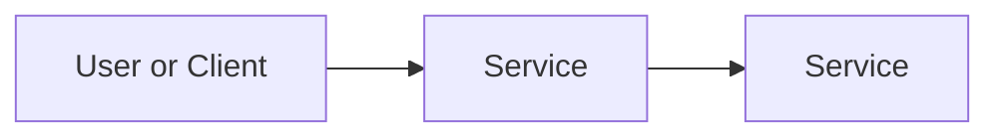

# Secure a New AWS Account for a Startup

## Business Scenario
A startup hires you to lock down its Aws accounts before engineers start building. They need protected master credentials, a safe everyday login, and simple checklist proving the account is secure.

## AWS Services Used
- Root user: Master account, Has unlimited power, so it should be protected and rarelt used
- IAM (Identity and Access MAnagement): Lets you create separate login ("users") with only permissions they need.
- MFA (Multi-Factor AUthentucation): A second loging step.

## Architecture

## What I Built
> Created a new IAM user for everyday work.

## Evidence
screnschots 

| Screenshot | What it proves |
| screenshots/root-mfa-enabled.png | MFA is active on the root account|
| screenshots/admin-user.png| A dedicated admin IAM user exisits with console access + MFA enabled

## Security Notes
> TODO:

## Cost Notes
See [cost-notes.md](cost-notes.md). 

## Cleanup
See [cleanup.md](cleanup.md). No paid resources created.

## Exam Mapping
See [exam-mapping.md](exam-mapping.md).
