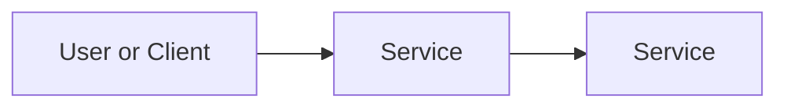

# Set Up Billing Alerts for a Small Business

## Business Scenario
Who asked for this and what problem are we solving?

> Hi Terence — here's the billing protection you asked for.

What You Asked For
You wanted to start using AWS without the risk of a surprise bill. Before any cloud project goes live, you need spending to be visible and capped by an alert — so you find out about a charge in real time, not at the end of the month.

## AWS Services Used
- Service 1: Budgets: lets you set mmonthly spending limits and get an email when the limit has been exceed
- Service 2: Billing Dashboard: home page is for everything cost related
- Service 3: Cost Explorer: a tool that shows which services are being charged 

## Architecture

## What I Built
> A monthly cost budget with an email alert, threshold, sized to protect the remaining account credit 

## Evidence
See the `screenshots/` folder.
screenshots/aws-budget.png

## Security Notes
>Billing data is sensitive - only the account owner.

## Cost Notes
See [cost-notes.md](cost-notes.md). aws budgets itself is free for the first two budgets two budgets per account.

## Cleanup
No cleanup needed

## Exam Mapping
See [exam-mapping.md](exam-mapping.md).
