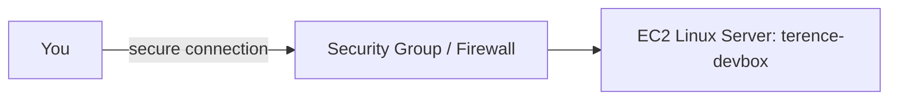

# A Cloud Server You Can Experiment On

Hi Terence — here's the test server you asked for, built and verified.

## What You Asked For
You wanted your own Linux server to experiment on — somewhere to test things and learn — without buying a physical machine or risking your main setup.

## What I Built For You
I launched a Linux server on AWS EC2 (`terence-devbox`), connected to it, and ran commands to confirm it works as a real, full computer in AWS's data center. Because EC2 charges by the hour while running, I terminated it after verifying it — so it isn't sitting in the background costing money. When you need one again, it takes minutes to launch a fresh one.

## The AWS Services I Used (plain English)
- **EC2 (Elastic Compute Cloud)**: renting a computer in AWS's data center. You pick the size, operating system, and how you log in.
- **AMI (Amazon Machine Image)**: the operating system template the server starts from (Amazon Linux).
- **Security group**: the firewall around the server, controlling who can connect.
- **Key pair**: the secure credential for logging in.
- **EC2 Instance Connect**: a way to connect to the server securely through the browser.

## Why This Setup Makes Sense For You
A physical test machine costs hundreds and sits idle most of the time. A cloud server you spin up only when needed and turn off when done — paying just for the hours used. It's a safe sandbox: break it, wipe it, relaunch in minutes, with nothing important at risk.

## How It Works

## Proof It Works
| Screenshot | What it shows you |
|---|---|
| screenshots/ec2-running.png | The server running with healthy status checks |
| screenshots/terminal-connected.png | A live connection into the server, running real commands |

## Security Notes
Best practice is to restrict server access (SSH/port 22) to a single trusted IP. For this demo I briefly opened access to connect, then terminated the server — so it wasn't left exposed. In a long-running setup, I'd keep access locked to a trusted IP only.

## What This Costs You
A t2/t3.micro is free-tier eligible, but EC2 bills hourly while running. I terminated it, so it costs nothing now. See [cost-notes.md](cost-notes.md).

## Maintenance / Cleanup
See [cleanup.md](cleanup.md) — the server was terminated after verification.

## Concepts Demonstrated
See [concepts-demonstrated.md](concepts-demonstrated.md).
