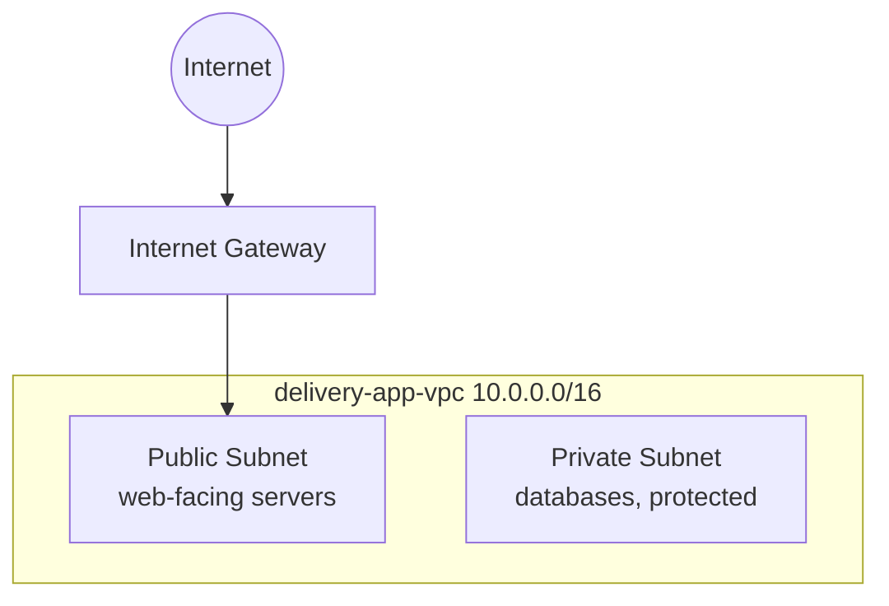

# Cloud Network for a Delivery App

Hi Terence — here's the private cloud network I set up as the foundation for a delivery app.

## What You Asked For
Before building an app, you need a secure, private network in the cloud for it to live in — a space where internet-facing servers can sit safely and everything is organized properly from the start.

## What I Built For You
I created a private network on AWS (a VPC) for the delivery app, with the pieces that let some parts face the internet while others stay protected:
- A **public subnet** — where internet-facing servers (like a web server) would live
- A **private subnet** — for things that should stay hidden (like a database)
- An **internet gateway** — the controlled doorway between the public subnet and the internet
- **Route tables** — the rules that direct traffic to the right place

This is the secure foundation. Servers and databases get added into it later — the network itself is ready.

## The AWS Services I Used (plain English)
- **VPC (Virtual Private Cloud)**: your own private section of AWS — like leasing a fenced-off lot in a large industrial park.
- **Subnets**: smaller sections within your lot. Public ones can reach the internet; private ones can't.
- **Internet Gateway**: the gate connecting your network to the internet.
- **Route tables**: the signs that tell traffic where to go (e.g., "internet traffic → use the gate").

## Why This Matters For You
Putting a database directly on the open internet is how data gets stolen. This setup separates what *should* be reachable (a website) from what *shouldn't* (customer data). Building the network this way from day one means the app is secure by design, not patched together later.

## How It Works

## Proof It Works
| Screenshot | What it shows you |
|---|---|
| screenshots/vpc-created.png | The delivery app VPC created |
| screenshots/subnets.png | The public and private subnets inside it |
| screenshots/route-table.png | The public subnet's route to the internet gateway |

## What This Costs You
Nothing. A VPC, subnets, route tables, and an internet gateway are all free. (The only networking piece that costs money is a NAT gateway, which I intentionally did not use.) See [cost-notes.md](cost-notes.md).

## Maintenance / Cleanup
See [cleanup.md](cleanup.md). Nothing bills, so there's nothing to tear down.

## Concepts Demonstrated
See [concepts-demonstrated.md](concepts-demonstrated.md).
