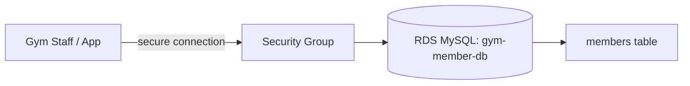

# Customer Database for a Gym

Hi Terence — here's the member database I built for the gym scenario.

## What You Asked For
A gym needs a proper database to store its members — names, membership types, and when they joined — that's reliable, backed up, and managed without hiring a database admin.

## What I Built For You
I created a managed MySQL database on AWS RDS, set up a `members` table, and added member records to prove it works. I connected to it directly and ran real queries against it. AWS handles the backups, patching, and uptime behind the scenes — there's no server to babysit.

| Member | Membership | Joined |
|---|---|---|
| Sydney Musoni | Premium | 2026-01-15 |
| Jordan Lee | Standard | 2026-02-03 |
| Casey Brooks | Premium | 2026-03-22 |
| Alex Rivera | Day Pass | 2026-04-10 |

## The AWS Services I Used (plain English)
- **Amazon RDS (Relational Database Service)**: a managed SQL database. AWS runs the database engine for you and handles backups and maintenance.
- **MySQL**: the database engine — a standard, widely-used relational database.
- **Security group**: the firewall controlling who can connect to the database.

## Why RDS Is The Right Fit For You
A gym's member list is structured — every member has the same fields (name, type, join date). That's exactly what a relational database is built for, and it makes questions like "how many Premium members joined this month?" easy to answer. RDS being *managed* means you get a real database without needing someone on staff to run it.

## How It Works

## Proof It Works
| Screenshot | What it shows you |
|---|---|
| screenshots/rds-instance.png | The RDS database running and available |
| screenshots/query-results.png | A live query returning the gym members |

## What This Costs You
A db.t3.micro on the free-tier-eligible setup is very low cost, but **RDS bills hourly while running**. I deleted the database after capturing proof, so it costs nothing now. See [cost-notes.md](cost-notes.md).

## Maintenance / Cleanup
See [cleanup.md](cleanup.md). The database was deleted after verification.

## Concepts Demonstrated
See [concepts-demonstrated.md](concepts-demonstrated.md).
