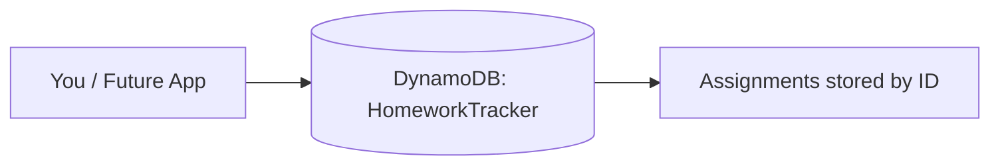

# Build a Homework Tracker Database

Hi Terence — here's the homework tracker database you asked for.

## What You Asked For
You wanted a simple way to keep track of homework — the subject, the assignment, when it's due, and whether it's done. It needs to be cheap, reliable, and not something that requires a tech team to maintain.

## What I Built For You
I created a database called `HomeworkTracker` using Amazon DynamoDB, and added sample assignments to prove it stores and retrieves real data. You (or an app built on top of it later) can add an assignment and pull it back instantly by its ID.

| Assignment ID | Subject | Assignment | Due Date | Status |
|---|---|---|---|---|
| HW-001 | Math | Chapter 5 problems | 2026-06-12 | Not started |
| HW-002 | Science | Chapter 6  | 2026-06-14 | Not started |
| HW-003 | History | Chapter 7  | 2026-06-16 | Not started |

## Why DynamoDB Is The Right Fit For You
- **No servers to manage** — AWS runs it for you, so there's nothing to maintain or fix.
- **Cheap at this size** — a tracker like this falls inside the free usage tier.
- **Grows with you** — if this ever became a real app with thousands of users, it scales automatically without changes.

It's the right tool because your data is simple and you want speed and zero maintenance — not a complex database built for heavy relationships.

## How It Works

## Proof It Works
| Screenshot | What it shows you |
|---|---|
| screenshots/dynamodb-table.png | Your table, created and active |
| screenshots/sample-items.png | Real homework assignments stored inside it |

## What This Costs You
Effectively nothing — it sits inside the free tier. See [cost-notes.md](cost-notes.md).

## Maintenance / Cleanup
See [cleanup.md](cleanup.md) for how to shut it down if you no longer need it.

## Concepts Demonstrated
See [concepts-demonstrated.md](concepts-demonstrated.md).
