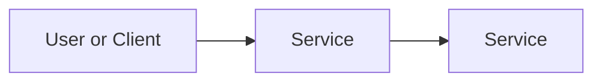

# Create a Serverless Function for a Pizza Shop

## Business Scenario
Who asked for this and what problem are we solving?

> TODO: Write 2-4 sentences a non-technical business owner could understand.

## AWS Services Used
- Service 1: plain-English purpose
- Service 2: plain-English purpose

## Architecture

## What I Built
> TODO: Describe the final product.

## Evidence
See the `screenshots/` folder.

| Screenshot | What it proves |
|---|---|
| screenshots/example.png | TODO |

## Security Notes
> TODO: Access, IAM, encryption, public/private choices, least privilege.

## Cost Notes
See [cost-notes.md](cost-notes.md).

## Cleanup
See [cleanup.md](cleanup.md).

## Exam Mapping
See [exam-mapping.md](exam-mapping.md).
