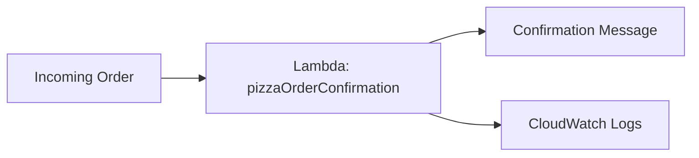

# Serverless Order Function for a Pizza Shop

Hi Terence — here's the order-confirmation function you asked for.

## What You Asked For
You wanted a small piece of backend logic that confirms a customer's pizza order — without paying for or managing a server that sits running all day. It should only do work when an order actually comes in.

## What I Built For You
I built a function using AWS Lambda called `pizzaOrderConfirmation`. When an order comes in (customer name, pizza type, size), it returns a confirmation message. It runs only when triggered, and you pay only for the few milliseconds it takes to run — nothing when it's idle.

I tested it with a sample order and confirmed it returns the right confirmation, and that the run was automatically logged for you.

## The AWS Services I Used (plain English)
- **AWS Lambda**: runs your code without a server. You upload the function, AWS runs it on demand, and you pay only for the runtime.
- **CloudWatch Logs**: automatically records each time the function runs, so you can see what happened and troubleshoot if needed.

## Why Serverless Is The Right Fit For You
A pizza shop doesn't need a server running 24/7 just to confirm orders. With Lambda, there's nothing to maintain, nothing sitting idle costing money, and it scales automatically if you suddenly get a rush of orders. You pay for actual orders processed — not for waiting around.

## How It Works

## Proof It Works
| Screenshot | What it shows you |
|---|---|
| screenshots/lambda-test-success.png | The function ran successfully and returned an order confirmation |
| screenshots/cloudwatch-logs.png | The run was automatically logged in CloudWatch |

## What This Costs You
Effectively nothing at this volume — Lambda includes a generous always-free tier. See [cost-notes.md](cost-notes.md).

## Maintenance / Cleanup
See [cleanup.md](cleanup.md).

## Concepts Demonstrated
See [concepts-demonstrated.md](concepts-demonstrated.md).# Serverless Order Function for a Pizza Shop

Hi Terence — here's the order-confirmation function you asked for.

## What You Asked For
You wanted a small piece of backend logic that confirms a customer's pizza order — without paying for or managing a server that sits running all day. It should only do work when an order actually comes in.

## What I Built For You
I built a function using AWS Lambda called `pizzaOrderConfirmation`. When an order comes in (customer name, pizza type, size), it returns a confirmation message. It runs only when triggered, and you pay only for the few milliseconds it takes to run — nothing when it's idle.

I tested it with a sample order and confirmed it returns the right confirmation, and that the run was automatically logged for you.

## The AWS Services I Used (plain English)
- **AWS Lambda**: runs your code without a server. You upload the function, AWS runs it on demand, and you pay only for the runtime.
- **CloudWatch Logs**: automatically records each time the function runs, so you can see what happened and troubleshoot if needed.

## Why Serverless Is The Right Fit For You
A pizza shop doesn't need a server running 24/7 just to confirm orders. With Lambda, there's nothing to maintain, nothing sitting idle costing money, and it scales automatically if you suddenly get a rush of orders. You pay for actual orders processed — not for waiting around.

## How It Works

## Proof It Works
| Screenshot | What it shows you |
|---|---|
| screenshots/lambda-test-success.png | The function ran successfully and returned an order confirmation |
| screenshots/cloudwatch-logs.png | The run was automatically logged in CloudWatch |

## What This Costs You
Effectively nothing at this volume — Lambda includes a generous always-free tier. See [cost-notes.md](cost-notes.md).

## Maintenance / Cleanup
See [cleanup.md](cleanup.md).

## Concepts Demonstrated
See [concepts-demonstrated.md](concepts-demonstrated.md).
