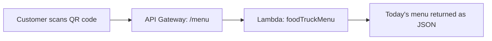

# API for a Food Truck Menu

Hi Terence — here's the scan-to-view menu API you asked for.

## What You Asked For
You wanted customers to scan a QR code at the truck and instantly see today's menu on their phone — no app to download, no printed menus to reprint when prices change.

## What I Built For You
I built a public API that returns your menu as data. When a customer scans the QR code, their phone hits this API and gets back the current menu instantly. To update the menu, you just change it in one place — every scan after that shows the new version.

The API is powered by a small serverless function behind the scenes, so there's no server to run or maintain.

## The AWS Services I Used (plain English)
- **API Gateway**: the public doorway. It takes the customer's request and routes it to the right place. This is the address the QR code points to.
- **AWS Lambda**: the function that holds your menu and returns it when asked. Runs only when someone scans — no idle cost.

## How It Works

## Proof It Works
| Screenshot | What it shows you |
|---|---|
| screenshots/api-response.png | The live API returning the food truck menu in a browser |
| screenshots/api-gateway-route.png | The API's GET /menu route configured in API Gateway |

## Why This Is The Right Fit For You
A food truck moves around and changes its menu often. This setup means one update changes the menu everywhere, costs almost nothing (you pay per scan, not for a server), and needs zero maintenance. The QR code never changes — only the menu behind it does.

## What This Costs You
Effectively nothing at a food truck's traffic. Both API Gateway and Lambda have generous free tiers. See [cost-notes.md](cost-notes.md).

## Maintenance / Cleanup
See [cleanup.md](cleanup.md).

## Concepts Demonstrated
See [concepts-demonstrated.md](concepts-demonstrated.md).
