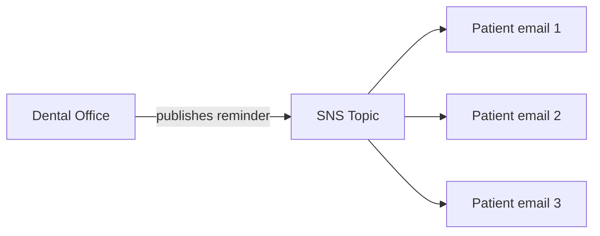

# Appointment Reminders with SNS

Hi Terence — here's the automated reminder system I built for the dental office scenario.

## What You Asked For
A dental office wants to send appointment reminders to patients automatically by email, instead of someone calling each person by hand.

## What I Built For You
I set up a notification system using AWS SNS. Patients subscribe with their email, and when the office sends a reminder, everyone subscribed gets it at once — automatically. I tested it end to end: created the reminder list, subscribed an email, and sent a reminder that landed in the inbox.

## The AWS Services I Used (plain English)
- **Amazon SNS (Simple Notification Service)**: a notification system. You create a "topic" (a broadcast channel), people subscribe to it, and any message you send goes out to all of them at once.

## How It Works (publish / subscribe)

## Why This Is The Right Fit For You
Calling or emailing every patient by hand doesn't scale and gets forgotten. With SNS, the office writes one reminder and every subscribed patient receives it instantly. It's reliable, automatic, and costs almost nothing.

## Proof It Works
| Screenshot | What it shows you |
|---|---|
| screenshots/sns-topic.png | The reminder topic with a confirmed subscriber |
| screenshots/email-received.png | The reminder email actually delivered to an inbox |

## What This Costs You
Effectively nothing — SNS includes a large free tier (the first million requests per month are free). See [cost-notes.md](cost-notes.md).

## Maintenance / Cleanup
See [cleanup.md](cleanup.md).

## Concepts Demonstrated
See [concepts-demonstrated.md](concepts-demonstrated.md).
