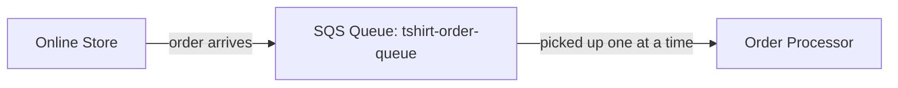

# Order Processing Queue with SQS

Hi Terence — here's the order queue I built for the T-shirt shop scenario.

## What You Asked For
An online T-shirt shop gets bursts of orders and needs a way to make sure none get dropped during a rush — a "waiting line" where orders sit safely until they can be processed.

## What I Built For You
I set up a message queue using AWS SQS. When an order comes in, it goes into the queue and waits. A worker (or system) then pulls orders off the line one at a time and processes them. I tested it by sending sample orders into the queue and receiving them back out — proving orders are held safely until handled.

## The AWS Services I Used (plain English)
- **Amazon SQS (Simple Queue Service)**: a waiting line for messages. One part of the system drops orders in; another part picks them up and processes them at its own pace.

## How It Works

## Why This Is The Right Fit For You
During a sale or a busy day, orders can come in faster than they can be handled. Without a queue, a rush could overwhelm the system and orders could get lost. SQS holds every order in line so nothing is dropped — the shop processes them steadily even if 100 come in at once. This is called
